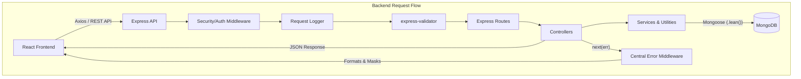
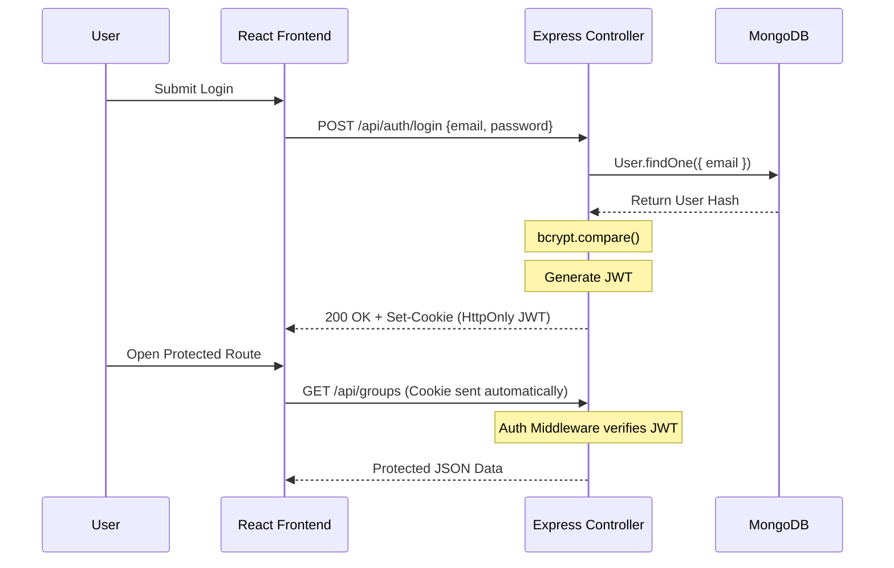

# SplitSmart

SplitSmart is a MERN-stack web application designed to help users track shared expenses, calculate exact group balances, and simplify debt settlements. It eliminates the manual math of trips and shared living arrangements by providing an automated ledger and activity feed. The project focuses heavily on implementing robust, production-quality engineering practices including centralized validation, safe error handling, API performance optimizations, and a complete automated CI testing pipeline.

## Features

- **Authentication**: Secure registration and login using bcrypt and JWT stored in an HttpOnly cookie.
- **Group Management**: Users can create, view, and manage shared expense groups.
- **Expense Management**: Add expenses with descriptions, amounts, and automatic member assignment.
- **Dynamic Splitting**: Support for Equal, Exact, and Percentage-based expense splitting.
- **Balances**: Automated calculation of exactly how much each user has paid and owes.
- **Simplified Settlements**: Generates suggested debt settlements and allows users to record direct payments.
- **Debt Reminders**: Functionality to trigger in-app reminders for unsettled debts.
- **Notifications**: In-app notifications for new expenses and settlements with read/unread tracking.
- **Activity Feed**: A paginated, database-driven feed showing the chronological history of group events.

## Technology Stack

### Frontend
- React 19 (via Vite)
- TailwindCSS v4
- React Router v7
- Axios

### Backend
- Node.js & Express 5
- JSON Web Tokens (jsonwebtoken)
- bcrypt
- express-validator

### Database
- MongoDB
- Mongoose ODM

### Security
- Helmet
- express-rate-limit
- CORS
- Custom sensitive-data logging redaction

### Testing
- **Backend**: Vitest, Supertest
- **Frontend**: Vitest, React Testing Library, jsdom
- **E2E**: Playwright

### CI/CD
- GitHub Actions

### API Documentation
- Swagger UI (swagger-ui-express)
- Static OpenAPI Object Specification

## Architecture

SplitSmart uses a standard client-server architecture with strict separation of concerns in the Express backend, ensuring incoming requests are sanitized, validated, and logged before hitting business logic.



## Authentication Flow

Authentication is stateless and relies exclusively on JSON Web Tokens stored securely in the browser.

1. **Registration**: User submits credentials; backend hashes the password using `bcrypt` (salt rounds = 10) and saves the user.
2. **Login**: User submits credentials; backend compares the hashed password.
3. **JWT Creation**: Upon success, a JWT containing the user's `_id` is signed using a secret key.
4. **HTTP-Only Cookie**: The JWT is returned via a `Set-Cookie` header marked as `HttpOnly`, `Secure`, and `SameSite: strict`.
5. **Auth Middleware**: Protected routes pass through `protect` middleware, which extracts the cookie, verifies the JWT signature, and attaches the user document to `req.user`.
6. **Logout**: Overwrites the cookie with an immediate expiration date.



## Authorization

The application strictly controls resource access through custom middleware and controller logic:
- **Authenticated Access**: Middleware (`protect`) rejects unauthenticated requests with a 401 status.
- **Group Membership Checks**: Users cannot view, add expenses to, or settle debts in groups they do not belong to. Evaluated by checking if `req.user._id` exists in `group.members`.
- **Expense Ownership**: Only the user who paid for an expense (`expense.paidBy`) can edit or delete it.
- **Settlement Permissions**: A settlement can only be recorded or deleted if the requesting user is either the sender or receiver of the funds.
- **Notification Ownership**: Users can only fetch or modify `isRead` statuses for their own `userId` notifications.

## Expense Splitting

When an expense is created, the system calculates exact splits for the group members.

- **Equal Split**: The total amount is divided exactly by the number of included members.
- **Exact Split**: Users input explicit amounts. The backend validates that the sum of all individual splits exactly equals the total expense amount.
- **Percentage Split**: Users input percentages. The backend validates that the sum equals 100% and calculates the absolute monetary value.
- **Validation**: If numeric data is malformed or totals mismatch, the API immediately rejects the payload with a 400 Bad Request.
- **Impact**: Split amounts define the exact financial liability recorded against each group member, directly driving balance calculations.

## Balance & Settlement Logic

Balances are dynamically aggregated rather than statically stored to prevent data corruption.

- **Total Paid**: The sum of all expenses where the user is `paidBy`.
- **Total Owed**: The sum of all splits assigned to the user across all expenses.
- **Member Balance**: Calculated as `Total Paid - Total Owed + Received Settlements - Sent Settlements`.
- **Debtors vs Creditors**: A negative balance indicates a debtor (they owe the group); a positive balance indicates a creditor (they are owed money).
- **Simplified Settlement Calculation**: A greedy algorithm matches the highest debtors to the highest creditors, generating "Suggested Settlements" to minimize the total number of transactions required to resolve all debts.
- **Settlement Recording**: When a user physically pays another user, they log a Settlement. This permanently adjusts their respective balances closer to zero.

## Notifications & Activity

The system maintains a chronological history of group events without relying on real-time push infrastructure.

- **Activity Feed**: Driven by standard database queries. It synthesizes raw `Expenses` and `Settlements` into a unified, paginated, date-sorted array representing the group's history.
- **Notifications Creation**: Controller logic creates notification documents in the database asynchronously when expenses or settlements are added.
- **Audience**: Notifications are targeted. For example, recording a settlement alerts the receiver. 
- **Debt Reminders**: A specific notification type generated when a user manually triggers a reminder on a debtor's balance.
- **Read/Unread**: Notifications default to unread. The frontend allows users to mark them as read, updating the `isRead` boolean in the database.

## Validation

Input sanitation and validation are strictly enforced using `express-validator`:
- **Route-Level Validation**: Middleware arrays intercept requests before the controller runs.
- **Required Fields**: Ensures missing fields (like email or password) trigger immediate 400 errors.
- **ObjectId Validation**: `isMongoId()` ensures URL parameters like `/:groupId` are valid MongoDB ObjectIds, preventing application crashes.
- **Numeric Sanitization**: Floating-point numbers (amounts) are strictly validated as numerics and coerced safely.
- **Cross-Field Validation**: Custom validation logic throws errors if exact splits don't match the total expense amount.
- **Error Routing**: A `validate` middleware aggregates these errors and pipes them to the client before executing business logic.

## Error Handling

- **AppError**: A centralized class inheriting from Node's `Error`, allowing controllers to assign specific HTTP status codes (400, 401, 403, 404).
- **Centralized Middleware**: Replaces repetitive `try/catch` block responses. Controllers invoke `next(err)`.
- **Mongoose/JWT Mapping**: Native MongoDB errors (like 11000 Duplicate Key or CastError) and JSONWebTokenErrors are intercepted and mapped to user-friendly messages and 400/401 status codes.
- **Production Error Masking**: If `NODE_ENV=production`, stack traces, file paths, and database schema internals are scrubbed. Internal 500 errors are masked as "Internal Server Error".
- **404 Route Handling**: A generic catch-all `app.use` at the very bottom of the Express routing chain intercepts unmapped endpoints and formats a 404 response.

## Security

- **bcrypt**: Hashes passwords with salt rounds to prevent rainbow table attacks.
- **JWT**: Statelessly authenticates users.
- **HttpOnly Cookie**: Ensures JavaScript cannot access the JWT, preventing attackers from stealing tokens via XSS. (Note: The application still requires standard XSS hygiene for DOM injection).
- **CORS**: Configured strictly to trust requests only from the deployed frontend origin.
- **Helmet**: Injects security headers (HSTS, Content-Security-Policy, etc.) to harden the HTTP response.
- **Rate Limiting**: `express-rate-limit` prevents brute-forcing login endpoints by throttling IP requests.
- **Request Limits**: Enforces strict JSON payload size limits via Express to mitigate memory-exhaustion (DoS) attacks.
- **Sensitive-Data Filtering**: A custom logging utility automatically redacts `password`, `token`, `cookie`, and `authorization` keys before writing to the console.

## Performance

- **MongoDB Indexes**: Compound indexes such as `{ group: 1, createdAt: -1 }` on Expenses and Settlements prevent full collection scans when aggregating balances or loading activity feeds.
- **Pagination**: The `skip()` and `limit()` methods are utilized on large collection endpoints (Activity, Notifications, Expenses) to bound database queries and payload sizes.
- **Query Limits**: Enforced `Math.min(limit, 100)` logic prevents a malicious user from requesting millions of records simultaneously.
- **`.lean()` Queries**: Appended to Mongoose read queries. This bypasses the heavy CPU and memory overhead of instantiating rich Mongoose Document instances, returning highly performant plain JavaScript objects.

## Testing Strategy

The repository utilizes three isolated layers of automated testing:

### Backend Tests
- **Tools**: Vitest, Supertest, MongoDB Memory Server.
- **Scope**: API endpoints, pagination math, boundary limits, and authorization rejection. Tests run against a transient in-memory database to prevent test pollution.
- **Count**: 40 tests across 6 suites.

### Frontend Tests
- **Tools**: Vitest, React Testing Library, jsdom.
- **Scope**: Component rendering, conditional logic (like rendering exact split fields), and mocked Axios context testing.
- **Count**: 14 tests across 3 suites.

### E2E Tests
- **Tools**: Playwright.
- **Scope**: Full browser-level verification of critical user journeys (Registration, Login, Creating a Group, Submitting an Expense, and opening Notification UI) utilizing a dedicated `splitsmart_e2e_test` database.
- **Count**: 9 E2E tests.

## CI/CD

SplitSmart utilizes GitHub Actions to enforce code quality automatically (`.github/workflows/ci.yml`).

- **Trigger**: Runs on `push` and `pull_request` to the `main` branch.
- **Services**: Spins up an Ubuntu runner and a native MongoDB v6 service.
- **Execution**:
  1. Installs backend dependencies (`npm ci`) and runs backend tests.
  2. Installs frontend dependencies.
  3. Runs frontend ESLint.
  4. Runs frontend component tests.
  5. Validates the frontend production build (`vite build`).
  6. Installs Chromium and executes Playwright E2E tests.
- **Result**: Acts as a Continuous Integration (CI) gate. If any check fails, the commit/PR is flagged as broken.

## Swagger / OpenAPI

- **Static OpenAPI Definition**: The API specification is stored in a structured JSON/JavaScript object in `backend/docs/swagger.js`.
- **Swagger UI**: Rendered using `swagger-ui-express` at the `/api-docs` endpoint.
- **Capabilities**: Developers can review required schemas and test endpoints natively in the browser. It includes documentation for `cookieAuth`, outlining exactly how the HTTP-only JWT acts as the bearer.

## Project Structure

```text
SplitSmart/
├── backend/
│   ├── config/
│   ├── controllers/
│   ├── middleware/
│   ├── models/
│   ├── routes/
│   ├── services/
│   ├── tests/
│   ├── utils/
│   └── docs/
├── frontend/
│   └── src/
├── e2e/
├── .github/
│   └── workflows/
└── package.json
```

## How to Run Locally

### Requirements
- Node.js (v18 or higher)
- MongoDB running locally on port 27017

### 1. Backend Setup
```bash
cd backend
npm install
npm run dev
```
*(Ensure a `.env` file exists in `backend/` containing `MONGO_URI`, `JWT_SECRET`, and `PORT`).*

### 2. Frontend Setup
```bash
cd frontend
npm install
npm run dev
```

### 3. Run Automated Tests
```bash
# Backend Unit Tests
cd backend && npm run test

# Frontend Unit Tests
cd frontend && npm run test

# Playwright E2E Tests
# Run from the root directory
npm install
npm run test:e2e
```

### 4. View Swagger Docs
Once the backend is running, navigate to `http://localhost:5000/api-docs`.

## API Overview

| Method | Endpoint | Purpose | Authentication |
|---|---|---|---|
| POST | `/api/auth/register` | Create a new user | Public |
| POST | `/api/auth/login` | Authenticate and receive cookie | Public |
| GET | `/api/groups` | Fetch groups the user belongs to | Required |
| POST | `/api/groups` | Create a new group | Required |
| GET | `/api/groups/:groupId` | Get specific group details and balances | Required |
| POST | `/api/groups/:groupId/expenses` | Add a new split expense | Required |
| GET | `/api/groups/:groupId/expenses` | Paginated list of group expenses | Required |
| POST | `/api/groups/:groupId/settlements` | Record a payment between members | Required |
| GET | `/api/notifications` | Get paginated user notifications | Required |

## Git Workflow

The project utilizes a strict feature-branch workflow to maintain integrity:
`main` → checkout `feature/branch-name` → Implementation → Local Testing → Commit → Push → Open Pull Request → CI Checks Pass → Merge → Delete feature branch → Update `main`.

## Interview Value / Key Engineering Decisions

- **JWT in HttpOnly Cookie**:
  - **Problem**: Storing JWTs in `localStorage` leaves users highly vulnerable to XSS token theft.
  - **Decision**: Send JWTs securely via HTTP response headers (`Set-Cookie: HttpOnly`).
  - **Why**: The browser natively attaches it to requests; JavaScript cannot access it.
  - **Result**: Drastically hardens authentication security.
- **Pagination & Indexes**:
  - **Problem**: Querying the full expense history for the Activity Feed caused massive memory spikes and slow N+1 style rendering.
  - **Decision**: Added compound indexes (`{ group: 1, createdAt: -1 }`) and strict `skip()`/`limit()` bounding.
  - **Why**: Keeps B-Tree lookups fast and prevents Node.js from pulling millions of documents into memory.
  - **Result**: API responses optimized from seconds to milliseconds under heavy loads.
- **Centralized Error Handling**:
  - **Problem**: Controllers were bloated with `res.status(500)` calls and leaked database schemas on crashes.
  - **Decision**: Implemented an `AppError` class and a final error middleware pipeline.
  - **Why**: To separate operational errors from programming bugs and dynamically mask sensitive traces when `NODE_ENV=production`.
  - **Result**: Cleaner codebase and secure, standardized JSON failure responses.

## Common Interview Questions

**1. Tell me about your project.**
SplitSmart is a MERN-stack application that calculates and tracks shared group expenses. I built it focusing heavily on robust engineering practices, specifically implementing centralized validation, secure JWT HttpOnly authentication, MongoDB performance optimizations (like pagination and lean queries), and a complete automated CI testing pipeline using Vitest and Playwright.

**2. Why did you choose MERN?**
MERN provides a unified language (JavaScript) across the stack. MongoDB's flexible document model handles sparse polymorphic data perfectly (like storing disparate types of Activity events), and React is highly suited for updating dynamic balance ledger UI state.

**3. Why HttpOnly cookies instead of localStorage?**
To mitigate XSS. An attacker running malicious JavaScript on the client can easily steal a JWT from `localStorage`. HttpOnly ensures the browser completely hides the cookie from the JavaScript context.

**4. How does expense splitting work?**
The frontend gathers the total cost and split preferences (Equal, Exact, Percentage). The backend `express-validator` middleware intercepts the payload and computationally verifies that individual shares perfectly sum to the total amount before saving it to the database.

**5. How are balances calculated?**
The backend calculates balances on-the-fly rather than statically storing them to prevent ledger corruption. It aggregates every expense a user paid for, subtracts the precise share they owed across all group expenses, and factors in recorded settlements.

**6. Why express-validator?**
To strictly sanitize and validate incoming payloads at the routing layer before business logic executes. This protects the database from malformed data and guarantees controller logic won't crash from missing fields.

**7. Why use `.lean()`?**
By default, Mongoose hydrates results into heavy Document instances with built-in methods (like `.save()`). Since most API routes only need to read and return JSON, appending `.lean()` skips this instantiation, saving significant server CPU and memory.

**8. What was the hardest bug you faced?**
When implementing the global 404 handler, I initially used `app.all('*')`. Due to Express 5 / Path-to-RegExp v8 changes, this crashed the router with a "Missing parameter name" error. I debugged it and fixed the architecture by replacing it with a generic fallback `app.use()` placed precisely at the end of the middleware chain.

## Future Improvements

*Note: The following are planned enhancements and are not currently implemented in the repository.*
- **Real-Time WebSockets**: Replacing the database-polling notification feed with Socket.IO for instant live updates.
- **Cloud Deployment**: Containerizing the app via Docker and deploying via AWS ECS or Vercel/Render.
- **Redis Caching**: Caching frequently accessed, read-heavy data like the group balance ledgers to further minimize MongoDB queries.

---
> **Interview Rule:** Everything described above reflects the current, verified repository implementation. No unverified technologies, infrastructures, or capabilities are claimed.
