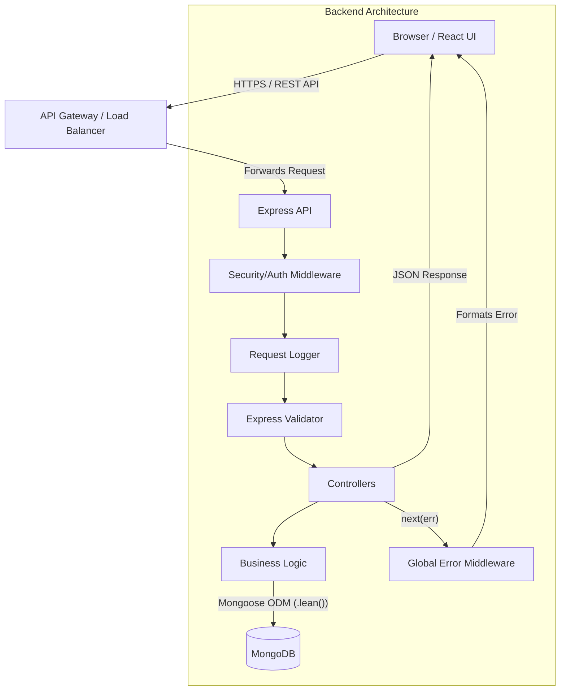
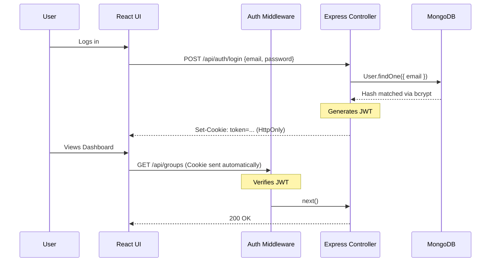

# SplitSmart

> **Smart expense splitting and settlement management for groups.**

SplitSmart is a full-stack MERN application designed to help users track shared expenses, calculate exact balances, and settle debts seamlessly. It eliminates the manual math of group trips, shared apartments, and team events by instantly computing who owes whom and maintaining a unified activity feed.

## 🚀 Live Demo

**Frontend (Vercel):**
https://split-smart-coral.vercel.app

**Backend API (Render):**
https://splitsmart-64jx.onrender.com

**API Health Check:**
https://splitsmart-64jx.onrender.com/api/health

## Table of Contents
1. [Project Overview](#project-overview)
2. [Technology Stack](#technology-stack)
3. [System Architecture](#system-architecture)
4. [Core Workflows](#core-workflows)
5. [Technical Implementation](#technical-implementation)
6. [Testing & CI/CD](#testing--cicd)
7. [Developer Workflow & Docs](#developer-workflow--docs)
8. [Interview Preparation / Technical Q&A](#interview-preparation--technical-qa)

---

## 1. Project Overview

**What it is:** A web application for shared expense tracking.
**Problem solved:** Manually calculating who paid for what and who owes whom after a trip or shared living arrangement is tedious and error-prone. SplitSmart automates this.
**Main Users:** Roommates, travel groups, event organizers, and colleagues.
**Key Features:**
- Secure group creation and member management.
- Dynamic expense splitting (Equal, Exact, Percentage).
- Automated settlement calculation (debt mapping).
- Real-time activity feeds and notification tracking.
- Fully documented API with Swagger.

---

## 2. Technology Stack

**Frontend:**
- **React 19 / Vite:** Lightning-fast UI rendering and build tooling.
- **TailwindCSS v4:** Utility-first styling for a responsive, modern interface.
- **React Router v7:** Client-side routing and protected navigation.

**Backend:**
- **Node.js & Express 5:** Robust API server with modern async routing.
- **MongoDB & Mongoose:** NoSQL document database optimized for flexible, relational-like queries.
- **JWT (JSON Web Tokens):** Secure, stateless authentication via HTTP-only cookies.
- **Swagger / OpenAPI (`swagger-jsdoc`, `swagger-ui-express`):** Interactive API documentation.

**Testing & Quality Assurance:**
- **Vitest & Supertest:** Backend unit and integration testing.
- **Vitest & React Testing Library (JSDOM):** Frontend component and hook testing.
- **Playwright:** End-to-end (E2E) browser testing for critical user journeys.
- **GitHub Actions:** CI/CD pipeline enforcing tests, linting, and builds on every push/PR.

---

## 3. System Architecture

SplitSmart follows a traditional client-server architecture with a strict separation of concerns in the backend.

### Complete Request/Response Flow:
1. **Browser**: User triggers an action (e.g., clicks "Add Expense").
2. **React Services**: Frontend `axios` service attaches the request payload. Credentials (HTTP-only cookies) are automatically sent.
3. **Express API**: The router intercepts the endpoint.
4. **Middleware**: Validates auth tokens, applies rate limiting, and sanitizes input (e.g., `express-validator`).
5. **Controllers**: Extracts validated request data and calls the appropriate service.
6. **Services/Utilities**: Contains business logic (like calculating group balances).
7. **Mongoose/MongoDB**: Executes optimized queries (using indexes and `.lean()` for read operations).
8. **Response**: JSON payloads are returned directly or caught by the Centralized Error Middleware if a crash occurs.
9. **React UI**: Context state updates and UI re-renders.

---

## 4. Core Workflows

### Authentication Flow
- **Registration**: Passwords are cryptographically hashed using `bcrypt` before database insertion.
- **Login**: Verifies credentials and generates a JWT.
- **HTTP-Only JWT Cookie**: The token is sent back as a `Secure`, `HttpOnly`, `SameSite=Strict` cookie. This completely mitigates XSS (Cross-Site Scripting) attacks as JavaScript cannot access the token.
- **Auth Middleware**: Intercepts requests to protected routes, parses the cookie, verifies the JWT signature, and attaches `req.user`.
- **Logout**: Clears the cookie on the client and server.

### Authorization Flow
- **Group Membership**: Middleware validates that `req.user._id` exists in the `group.members` array before allowing expense or settlement creation.
- **Resource Ownership**: Users can only edit/delete their own expenses, validated via `expense.paidBy.equals(req.user._id)`.
- **Settlements**: Users can only record settlements involving themselves (either as sender or receiver).
- **Notifications**: Users can only fetch and mark their own notifications as read.

### Expense Splitting Flow
- **Equal Split**: Total amount is divided equally among selected members.
- **Exact Split**: Users input exact amounts; the backend validates that the sum equals the total.
- **Percentage Split**: Users input percentages; validated to sum to 100%.
- **Settlement Calculation**: A running ledger algorithm computes the differential between `total paid` and `total owed` to generate suggested settlements.

### Settlement Flow
- **Balances**: Aggregated via historical expense splits.
- **Suggested Settlements**: Debt-simplification logic matches users with positive balances (creditors) to those with negative balances (debtors).
- **Recording Settlements**: Persists a transaction linking `from` and `to` users, reducing their outstanding debt.
- **Reminders**: Triggers an internal service to send an automated "Debt Reminder" notification to debtors.

### Notification & Activity Flow
- **Creation**: Actions (adding expenses, recording settlements) asynchronously trigger notification creation in the DB.
- **Activity Feed**: Dynamically synthesized by combining raw `Expenses` and `Settlements` or reading from a dedicated `Activity` collection, sorted by date.
- **Read/Unread**: Notifications have an `isRead` boolean flag that toggles upon user interaction.

---

## 5. Technical Implementation

### API Validation
- **`express-validator`**: Ensures incoming data shapes are strictly enforced before hitting controllers.
- **ObjectId Validation**: Prevents MongoDB CastErrors by rejecting malformed IDs at the router level.
- **Cross-Field Validation**: Ensures custom logic (e.g., exact split totals matching the expense amount).
- **Sanitization/Coercion**: Trims strings, escapes HTML, and coerces stringified numbers to Floats.

### Error Handling
- **AppError Class**: A custom extension of the standard Error object handling operational errors (status codes 400, 401, 403, 404).
- **Centralized Error Middleware**: All controllers pipe asynchronous errors via `next(err)` to a single handler.
- **Production Masking**: In `NODE_ENV=production`, stack traces, internal MongoDB schemas, and raw JWT errors are scrubbed and replaced with generic "Internal Server Error" messages to prevent architecture leakage.
- **404 Route Handling**: A catch-all wildcard at the bottom of the Express routing stack gracefully handles unknown endpoints.

### Security
- **Helmet**: Injects secure HTTP headers (HSTS, NoSniff, XSS-Protection).
- **Rate Limiting**: Throttles brute-force login attempts and spam requests via `express-rate-limit`.
- **Request Limits**: JSON payload limits prevent memory-exhaustion (DoS) attacks.
- **Sensitive Data Masking**: A custom robust `logger.js` dynamically redacts `password`, `token`, and `cookie` strings before printing to `stdout`.
- **CORS**: Strictly configured to trust only the designated frontend origin.

### Performance Optimizations
- **MongoDB Indexes**: Compound indexes on `{ group: 1, createdAt: -1 }` and `{ members: 1 }` prevent heavy collection scans on large datasets.
- **Pagination**: The Activity Feed and Expenses list utilize `skip()` and `limit()`.
- **Limit Enforcement**: A hard mathematical bound (`Math.min(limit, 100)`) secures the server against malicious query limits.
- **Lean Queries**: Using Mongoose's `.lean()` on GET requests returns plain JavaScript objects, entirely bypassing the heavy CPU overhead of hydrating Mongoose Documents.

---

## 6. Testing & CI/CD

SplitSmart relies on a multi-tiered testing strategy:
- **Backend (40 Tests)**: `Vitest` + `Supertest` + `MongoDB Memory Server`. Validates logic, pagination math, auth rejections, and DB constraints natively.
- **Frontend (14 Tests)**: `Vitest` + `React Testing Library` + `JSDOM`. Mocks `axios` and `react-router` to verify component rendering and state transitions.
- **E2E (9 Tests)**: `Playwright`. Boots a test DB, actual API, and real Chromium browser to verify end-to-end user journeys (auth, creating groups, submitting expenses).

### Continuous Integration (CI)
- **GitHub Actions**: Configured to run on every `push` and `pull_request` to `main`.
- **Pipeline Flow**:
  1. Installs backend/frontend dependencies (`npm ci`).
  2. Runs backend unit tests.
  3. Runs frontend linting.
  4. Runs frontend unit tests.
  5. Executes a production frontend build (`vite build`).
  6. Downloads Chromium and runs full Playwright E2E tests.
  *The branch is blocked from merging if any step fails.*

---

## 7. Developer Workflow & Docs

### Swagger / OpenAPI
- **What it is**: An interactive documentation dashboard.
- **Purpose**: Allows frontend engineers to visualize, test, and understand the backend API contracts natively.
- **Usage**: Hosted at `/api-docs`. Includes `cookieAuth` configurations so developers can securely test protected routes directly from the browser.

### Git Feature-Branch Workflow
SplitSmart utilizes a strict feature-branch workflow to maintain main branch integrity:
`main` -> `git checkout -b feature/name` -> Implementation -> Local Testing -> `git commit` -> `git push` -> **Open Pull Request (PR)** -> Code Review & CI Passes -> **Merge** -> Delete feature branch -> Update `main`.

---

## 8. Interview Preparation / Technical Q&A

<strong>Click to expand Interview Questions & Answers</strong>

### 1. Tell me about your project
"SplitSmart is a MERN-stack application that automates the calculation and tracking of shared group expenses. It features secure JWT authentication, dynamic expense splitting algorithms, and a real-time activity feed. I heavily focused on production-readiness by implementing centralized error handling, robust MongoDB query optimization (indexes and pagination), and a complete automated CI/CD testing pipeline using Vitest and Playwright."

### 2. Why the MERN stack?
"I chose MERN because using JavaScript across the entire stack drastically reduces context switching. MongoDB’s document model maps perfectly to JSON-heavy APIs and provides the schema flexibility needed for complex, evolving models like 'Activities' and 'Expense Splits'. React provides a highly responsive UI necessary for dynamically calculating group balances."

### 3. Why MongoDB?
"Unlike relational databases, MongoDB handles sparse data and polymorphic structures effortlessly. For example, the `Activity` feed requires storing different metadata depending on whether the event is an 'expense added' or a 'settlement paid'. NoSQL makes this seamless."

### 4. Why JWT in an HTTP-Only Cookie instead of LocalStorage?
"Security. Storing tokens in `localStorage` exposes them to Cross-Site Scripting (XSS) attacks. By using `HttpOnly`, `Secure`, and `SameSite` cookies, the browser handles the token transparently, and malicious JavaScript cannot access it."

### 5. How does authorization work?
"Beyond basic authentication, I implemented ownership middleware. Before modifying an expense, the API queries the DB to ensure `expense.paidBy` matches `req.user._id`. For group-level actions, it checks if `req.user._id` exists in the `group.members` array."

### 6. How do expense splitting and settlements work?
"The backend calculates splits based on the chosen type (Equal, Exact). It then aggregates all group expenses to calculate a ledger of 'total paid' vs 'total owed' for each user. A debt-simplification algorithm generates 'suggested settlements' by matching the highest debtors to the highest creditors until balances neutralize."

### 7. Why centralized error handling & validation middleware?
"Without centralized error handling, controllers become bloated with repetitive `try/catch` logic and `res.status(500)`. My global middleware intercepts `next(err)`, normalizes Mongoose errors, and ensures stack traces are never leaked in production. Validation middleware (`express-validator`) ensures malicious or malformed data never even reaches my business logic."

### 8. Why pagination, indexes, and `.lean()`?
"Performance. Without pagination and an index on `{ group: 1, createdAt: -1 }`, the Activity Feed would trigger a full-collection scan in MongoDB, crashing the server as the app scales. Using Mongoose’s `.lean()` method bypasses the CPU-heavy process of instantiating Mongoose Documents, returning plain JSON and reducing response times from seconds to milliseconds."

### 9. Why Swagger?
"Swagger provides a living, interactive contract of my API. It drastically speeds up frontend integration because developers can see exactly what request bodies are expected and test endpoints without writing curl commands."

### 10. Why automated testing (Vitest & Playwright) and CI?
"Tests prevent regressions. Vitest handles isolated backend logic and frontend component rendering, while Playwright mimics a real user clicking through the browser (E2E). GitHub Actions (CI) acts as a gatekeeper, automatically running these tests on every push, ensuring broken code is never deployed to production."

### 11. Biggest bugs encountered & how they were fixed?
**Bug:** The Activity Feed endpoint caused memory spikes and timeouts.
**Fix:** Discovered via logging that the API was pulling the entire history of expenses into Node memory. Fixed by implementing MongoDB `limit()`, `skip()`, indexing, and `.lean()`.
**Bug:** Express wildcard routing (`app.all('*')`) was crashing with Path-to-RegExp v8 errors.
**Fix:** Fixed by replacing it with a generic `app.use((req, res, next) => next(new AppError('404')))` at the very bottom of the middleware stack.

---
*End of Documentation*
